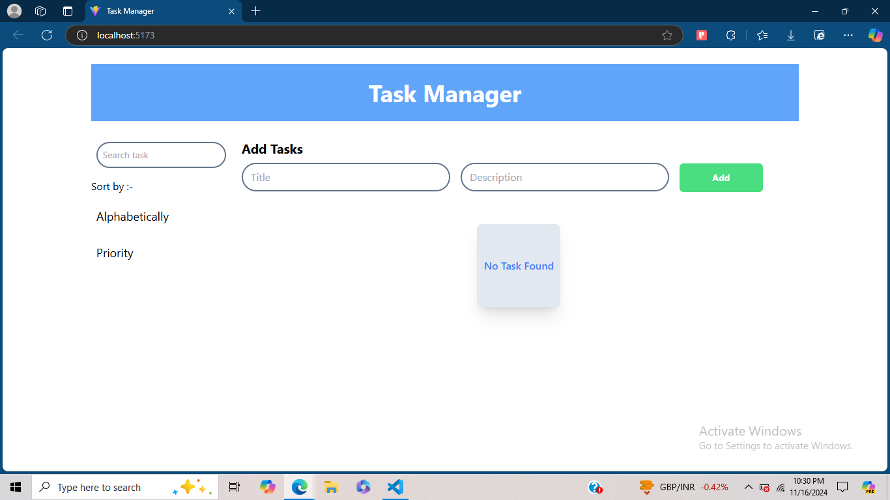
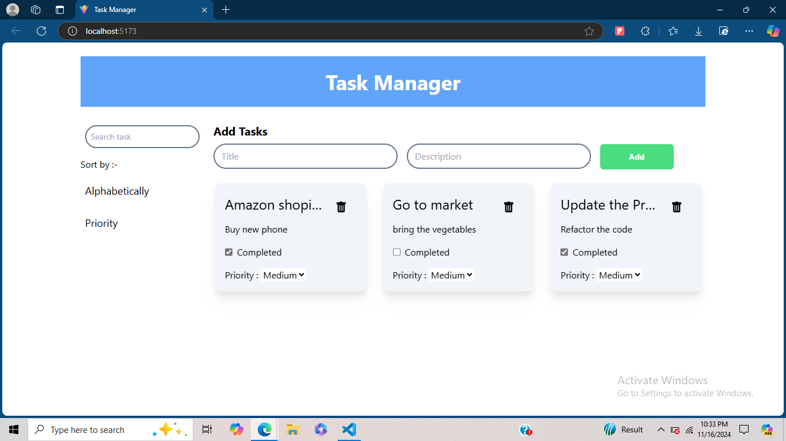
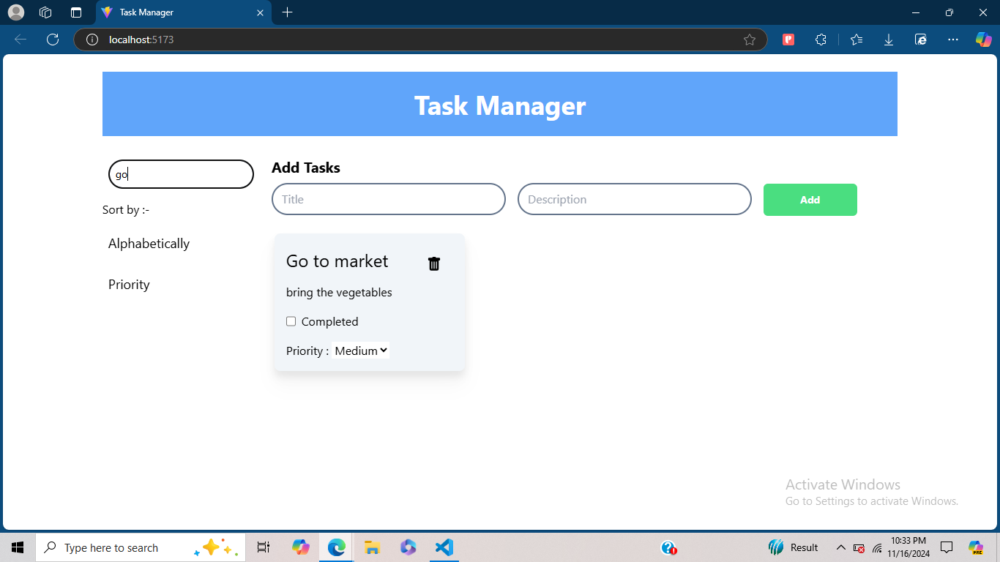
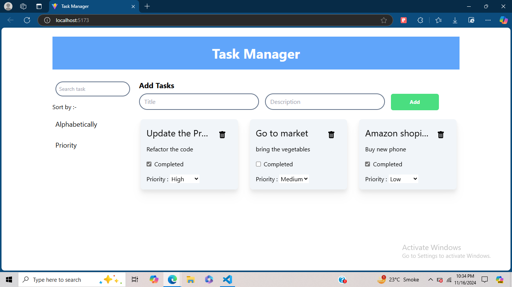
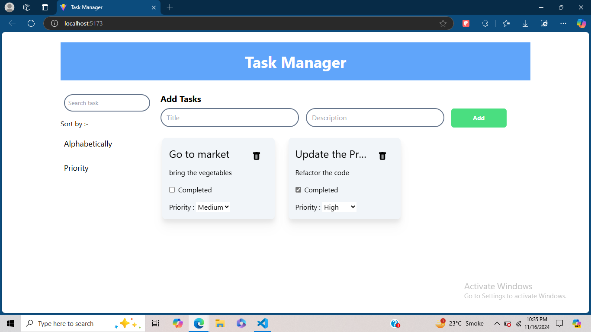

# Task Manager Application

A task management application built with ReactJS, allowing users to add, delete, search, sort, and manage tasks. The application also supports task persistence using local storage.

## Features
- Add, edit, and delete tasks.
- Mark tasks as complete/incomplete.
- Sort tasks alphabetically or by priority.
- Persistent data using local storage.

## Setup Instructions
1. Clone the repository:
   ```bash
   git clone https://github.com/CodeNik07/flarelink-assignment.git
   cd flarelink-assignment

2. Install dependencies and start the development server
    ```bash
    npm install
    npm run dev

## Screenshots
1. Task Manager UI


2. Add Task


3. Search Task


4. Sort Task


5. Delete Task
